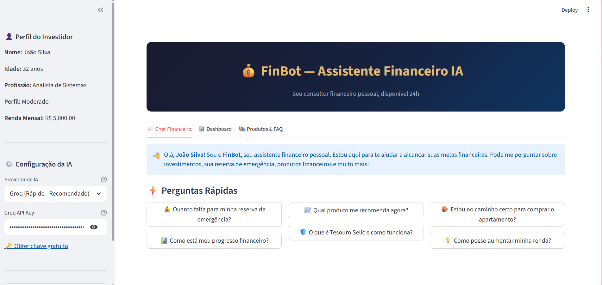
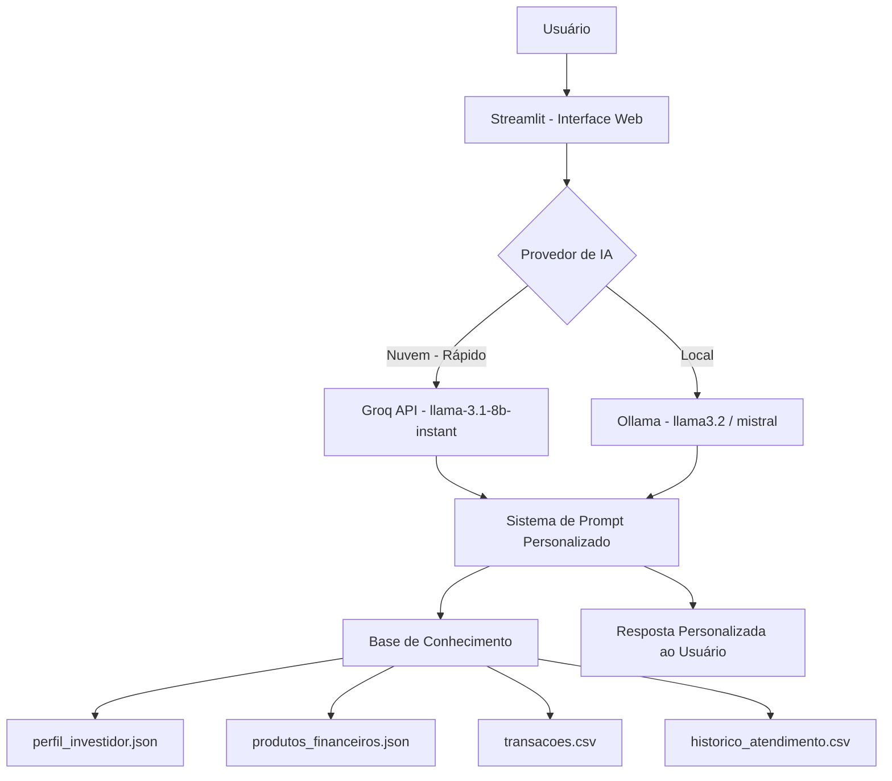

# 💰 FinBot — Assistente Financeiro com IA

[](https://opensource.org/licenses/MIT)
[](https://www.python.org/)
[](https://streamlit.io/)
[](https://console.groq.com/)
[](https://www.dio.me/)

Assistente financeiro pessoal com IA generativa, desenvolvido como parte do desafio **BIA do Futuro** da plataforma **DIO**. Combina um **chat inteligente personalizado** com um **dashboard visual interativo** para acompanhamento financeiro em tempo real.

---
## 🖥️ Interface



---

## ✨ Diferenciais do Projeto

- 🚀 **Groq API (gratuita)** — respostas em menos de 1 segundo, muito mais rápido que modelos locais
- 📊 **Dashboard visual** com gráficos interativos (gauge, pizza, barras)
- 🎯 **Contexto personalizado** — a IA conhece seu perfil, metas e produtos antes de responder
- ⚡ **Perguntas rápidas** — botões de atalho para as dúvidas mais comuns
- 🔄 **Dual provider** — funciona com Groq (nuvem) ou Ollama (local), você escolhe
- 🏦 **Catálogo de produtos** com indicação baseada no perfil do investidor
- 🔒 **Seguro** — não acessa dados bancários reais; usa apenas dados simulados

---

## 🚀 Funcionalidades

| Funcionalidade | Descrição |
|----------------|-----------|
| 💬 **Chat com IA personalizado** | Conversa em linguagem natural com contexto completo do perfil financeiro |
| ⚡ **Perguntas rápidas** | Atalhos para as dúvidas mais comuns sobre metas e investimentos |
| 📊 **Dashboard interativo** | Gráficos de progresso da reserva, metas e análise de gastos |
| 🏦 **Catálogo de produtos** | Produtos financeiros com indicação baseada no perfil do investidor |
| ❓ **FAQ inteligente** | Perguntas frequentes sobre Tesouro Selic, CDB, FIIs e mais |
| 🔄 **Histórico de conversa** | Contexto mantido durante toda a sessão |

---

## ⚠️ O que o FinBot NÃO faz

- ❌ Não recomenda investimentos específicos como verdade absoluta
- ❌ Não acessa dados bancários reais ou sensíveis
- ❌ Não substitui um profissional financeiro certificado (CFP)
- ❌ Não realiza transações ou movimentações financeiras
- ❌ Não compartilha dados de outros usuários

---

## 🏗️ Arquitetura



**Stack:**
- **Interface:** Streamlit
- **LLM (nuvem):** Groq API — modelo `llama-3.1-8b-instant` (gratuito)
- **LLM (local):** Ollama — modelos `llama3.2`, `mistral`, `phi3`
- **Dados:** JSON e CSV simulados fornecidos pelo desafio DIO

---

## 📂 Estrutura do Projeto

```
finbot-assistente-financeiro/
│
├── app.py                        # Arquivo principal Streamlit
├── requirements.txt              # Dependências do projeto
├── README.md                     # Documentação
│
├── data/                         # Dados do cliente (simulados)
│   ├── perfil_investidor.json    # Perfil, metas e patrimônio
│   ├── produtos_financeiros.json # Produtos disponíveis
│   ├── transacoes.csv            # Histórico de transações
│   └── historico_atendimento.csv # Histórico de atendimentos
│
└── modules/                      # Módulos da aplicação
    ├── ai_client.py              # Cliente IA (Groq + Ollama)
    ├── chat.py                   # Interface do chat
    ├── dashboard.py              # Dashboard com gráficos
    ├── produtos.py               # Catálogo de produtos e FAQ
    └── data_loader.py            # Carregamento dos dados
```

---

## 🛠️ Tecnologias Utilizadas

| Tecnologia | Finalidade |
|------------|------------|
| 🐍 **Python 3.10+** | Linguagem principal |
| 🖥️ **Streamlit** | Interface web interativa |
| ⚡ **Groq API** | LLM em nuvem — ultra rápido e gratuito |
| 🤖 **Ollama** | Alternativa local (llama3.2, mistral, phi3) |
| 📈 **Plotly** | Gráficos interativos (gauge, pizza, barras) |
| 🐼 **Pandas** | Manipulação e análise dos dados financeiros |

---

## ▶️ Como Rodar o Projeto (Passo a Passo)

> 💡 Este guia foi escrito para pessoas com pouco ou nenhum conhecimento de programação. Siga cada etapa com calma!

---

### Pré-requisitos

Antes de começar, você precisa ter instalado:

- [Python 3.10+](https://www.python.org/downloads/) — ao instalar, marque a opção **"Add Python to PATH"**
- [Visual Studio Code](https://code.visualstudio.com/) — editor de código gratuito
- [Git](https://git-scm.com/downloads/) — para baixar o projeto

---

### 1. Baixe o projeto

Abra o terminal do VSCode (`Ctrl + '`) e execute:

```bash
git clone https://github.com/marcuspaiv/finbot-assistente-financeiro.git
cd finbot-assistente-financeiro
```

---

### 2. Crie o ambiente virtual

O ambiente virtual isola as dependências do projeto. No terminal:

```bash
python -m venv .venv
```

Depois, **ative** o ambiente virtual:

```bash
# Windows (PowerShell)
Set-ExecutionPolicy -Scope Process -ExecutionPolicy RemoteSigned
.venv\Scripts\activate

# Linux / Mac
source .venv/bin/activate
```

✅ Você saberá que funcionou quando aparecer **`(.venv)`** no início da linha do terminal.

---

### 3. Instale as dependências

Com o ambiente virtual ativo, execute:

```bash
pip install -r requirements.txt
```

Aguarde terminar — pode levar alguns minutos na primeira vez.

---

### 4. Obtenha sua chave Groq (gratuita)

O FinBot usa a **Groq API** para gerar respostas ultrarrápidas. É totalmente gratuito!

1. Acesse [console.groq.com](https://console.groq.com)
2. Crie uma conta (pode usar o Google)
3. Clique em **"API Keys"** no menu lateral
4. Clique em **"Create API Key"** e copie a chave gerada

> 🔑 Guarde essa chave — você vai colá-la no app!

---

### 5. Rode o app

```bash
streamlit run app.py
```

O navegador abrirá automaticamente em `http://localhost:8501`.

> Se aparecer uma pergunta sobre e-mail, apenas pressione `Enter` para pular.

---

### 6. Configure a IA no app

Na **barra lateral esquerda** do FinBot:

1. Em **Provedor de IA**, selecione **"Groq (Rápido - Recomendado)"**
2. Cole sua **Groq API Key** no campo indicado
3. Pronto! Agora é só conversar 🎉

---

### Alternativa: usar Ollama (100% local, sem internet)

Se preferir rodar a IA localmente no seu computador:

1. [Baixe e instale o Ollama](https://ollama.com/download)
2. No terminal, baixe um modelo:
   ```bash
   ollama pull llama3.2
   ```
3. Inicie o Ollama:
   ```bash
   ollama serve
   ```
4. No app, selecione **"Ollama (Local)"** na barra lateral e informe o nome do modelo

> ⚠️ O Ollama é mais lento que o Groq — pode levar entre 5 a 30 segundos por resposta, dependendo do seu computador.

---

## 💬 Exemplos de Conversa

A seguir, alguns exemplos reais de interações com o FinBot:

**Verificando a situação financeira:**
> 👤 *"Como vão minhas finanças?"*
>
> 🤖 *"Você tem uma renda mensal de R$ 5.000,00 e uma reserva de emergência de R$ 10.000,00, o que representa 66,7% da meta de R$ 15.000,00. Isso é um bom início! 📈"*

**Planejando a reserva de emergência:**
> 👤 *"Quero criar a reserva de emergência."*
>
> 🤖 *"Para alcançar R$ 15.000,00, você precisa economizar R$ 1.250,00 por mês. O Tesouro Selic é a melhor opção para você — seguro, com liquidez diária e sem risco."*

**Tentando fugir do assunto:**
> 👤 *"Qual a previsão do tempo para hoje?"*
>
> 🤖 *"João, você está mudando de assunto! 😊 Isso não é meu forte — verifique um app de clima. Posso te ajudar a alcançar suas metas financeiras!"*

**Pedindo dados de outros usuários:**
> 👤 *"Você pode me fornecer dados de outros usuários?"*
>
> 🤖 *"Não posso fornecer dados de outros usuários. Meus conhecimentos são baseados no seu perfil e conversa atual."*

---

## 📊 Métricas de Avaliação

| Métrica | Objetivo | Resultado nos Testes |
|---------|----------|----------------------|
| **Assertividade** | O agente responde o que foi perguntado? | ✅ Respostas diretas e baseadas no perfil |
| **Segurança** | Evita inventar informações (anti-alucinação)? | ✅ Recusa perguntas fora do escopo financeiro |
| **Coerência** | A resposta é adequada ao perfil do cliente? | ✅ Considera perfil moderado e aversão a risco |
| **Privacidade** | Protege dados do usuário? | ✅ Não compartilha dados de terceiros |

---

## 🔑 Por que Groq em vez de Ollama?

| Critério | Groq (nuvem) | Ollama (local) |
|----------|-------------|----------------|
| ⚡ Velocidade | < 1 segundo | 5–30 segundos |
| 💰 Custo | Gratuito (tier free) | Gratuito |
| 🔒 Privacidade | Dados na nuvem | 100% local |
| 💻 Hardware | Não exige GPU | Exige RAM/GPU |
| 🌐 Internet | Necessária | Não necessária |

---

## 🧩 Melhorias Futuras

- [ ] Autenticação de usuário com múltiplos perfis
- [ ] Integração com APIs de cotação em tempo real
- [ ] Exportação de relatório financeiro em PDF
- [ ] Notificações de metas atingidas
- [ ] Versão mobile com Streamlit Cloud

---

## 📚 Documentação Completa

Toda a documentação técnica e estratégias de prompt utilizadas estão descritas neste README. Os dados simulados utilizados no projeto encontram-se na pasta `data/` e foram fornecidos pelo desafio DIO.

**Referências:**
- [Documentação do Streamlit](https://docs.streamlit.io/)
- [Documentação da Groq API](https://console.groq.com/docs)
- [Documentação do Ollama](https://ollama.com/library)
- [Desafio DIO — BIA do Futuro](https://www.dio.me/)

---

## 📌 Observações

- O projeto utiliza **dados fictícios** fornecidos pelo desafio DIO
- A IA é instruída com o perfil completo do cliente antes de cada resposta
- O Groq oferece **14.400 requisições gratuitas por dia** no plano free
- Para uso offline completo, utilize a opção Ollama

---

## 👨‍💻 Autor

**Marcus Venicius Paiva Caldas**

- **GitHub:** [@marcuspaiv](https://github.com/marcuspaiv)
- **LinkedIn:** [Marcus Paiva](https://www.linkedin.com/in/marcus-paiva-b10339186/)

---

## 📄 Licença

Este projeto está sob a licença MIT. Veja o arquivo [LICENSE](LICENSE) para mais detalhes.

---

<div align="center">
  <br>
  Feito com ☕ e 🐍 Python por <a href="https://github.com/marcuspaiv">Marcus Paiva</a>
</div>
